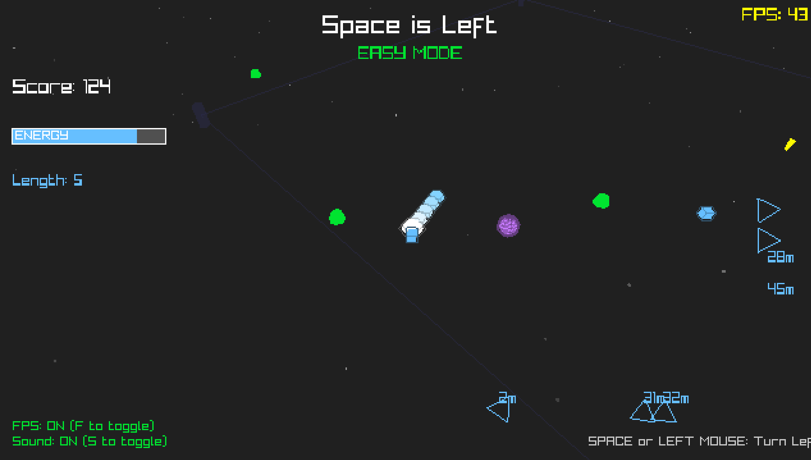

# Space is Left

A unique twist on the classic snake game set in space! Navigate your line rider through the cosmic arena, but there's a catch - **you can only steer left!**



## 🎮 Game Concept

In Space is Left, you control a futuristic line rider that continuously moves forward through space. The core challenge: you can only turn left, making navigation a strategic puzzle. Choose between Easy mode for a relaxed experience or Hardcore mode where everything moves at 4x speed! Collect energy to survive, grab powerups to enhance your abilities, and see how long you can last in the infinite void of space!

## 🕹️ How to Play

### Controls
- **SPACE** or **LEFT MOUSE BUTTON** - Turn left (the only way to steer!)
- **TAB** - Switch between camera modes (Orbit/Isometric)
- **P** - Pause/Resume game
- **ENTER** - Start game from menu / Restart when game over
- **M** - Return to main menu (when game over)
- **1** - Select Easy difficulty (in menu)
- **2** - Select Hardcore difficulty (in menu)
- **ESC** - Exit game

### 🎮 Gamepad/Controller Support

The game fully supports USB gamepads and controllers! When a gamepad is connected, you can use:

#### Menu Navigation
- **D-Pad Left** - Select Easy difficulty
- **D-Pad Right** - Select Hardcore difficulty  
- **A Button** - Start game / Restart when game over
- **B Button** - Return to main menu (when game over)
- **Start Button** - Pause/Resume game

#### Gameplay Controls
- **A Button** - Turn left (digital control)
- **Right Bumper (RB/R1)** - Turn left (digital control)
- **Right Trigger (RT/R2)** - Turn left (analog - variable turn speed)
- **Left Stick (Left)** - Turn left (analog - variable turn speed)
- **Y Button** - Switch camera modes

#### Special Features
- **Analog Control**: Right trigger and left stick provide variable turn speeds
- **Auto-Detection**: Gamepads are automatically detected when connected
- **Hot-Swapping**: You can connect/disconnect gamepads during gameplay
- **Multi-Input**: Keyboard, mouse, and gamepad controls work simultaneously

### Camera Controls
- **Mouse Wheel** - Zoom in/out
- **Middle Mouse + Drag** - Pan camera
- **WASD/Arrow Keys** - Move camera (Isometric mode)
- **G** - Toggle grid
- **X** - Toggle axes
- **I** - Toggle debug info

### Gameplay
1. Choose your difficulty from the main menu:
   - **Easy Mode**: Normal speed for beginners
   - **Hardcore Mode**: 4x speed for experts - everything moves faster!
2. Your line rider constantly moves forward and drains energy
3. Press SPACE or hold LEFT MOUSE to turn left
4. Collect blue energy cubes to refill your energy and grow longer
5. Avoid crashing into yourself (segments 4+ away from head)
6. Complete full circles to earn bonus points
7. Grab powerups for special abilities
8. Survive as long as possible and beat your high score (tracked separately per difficulty)!

## 🎯 Powerups

- **🔷 Energy (Blue)** - Refills energy and grows your line
- **⚡ Speed Boost (Yellow)** - Temporary speed increase
- **⏱️ Slow Time (Purple)** - Slows down time temporarily
- **🛡️ Shield (Green)** - Protection from self-collision
- **📦 Shrink (Orange)** - Reduces your line length
- **⭐ Bonus Points (Gold)** - Extra score points

## 🏗️ Building from Source

### Requirements
- C compiler (gcc, clang, or MSVC)
- [RayLib](https://www.raylib.com/) library (5.0 or later)
- OpenGL support

### Linux/macOS

```bash
# Install dependencies (Ubuntu/Debian)
make install-deps-ubuntu

# Build the game
make

# Run the game
make run

# Build optimized release version
make release
```

### Windows

#### Option 1: Cross-compile from Linux
```bash
# Install MinGW cross-compiler
make install-mingw-ubuntu

# Build Windows executable
make windows

# Or build with bundled RayLib
make windows-with-raylib
```

#### Option 2: Native Windows build
Use the provided Visual Studio project or compile with MinGW:
```cmd
gcc main.c engine.c camera.c render.c input.c utils.c -o space-is-left.exe -lraylib -lopengl32 -lgdi32 -lwinmm
```

### Build Options

```bash
make debug          # Debug build with symbols
make release        # Optimized release build
make all-platforms  # Build for all platforms
make dist          # Create distribution package
make clean         # Clean build files
```

## 🎨 Engine Features

Space is Left is built on a custom game engine with:

- **Dual Camera Systems**: 3D orbit camera and isometric strategy camera
- **Entity Component System**: Flexible entity management
- **Particle System**: Dynamic visual effects
- **Modular Architecture**: Separated engine, rendering, input, and game logic
- **Cross-platform**: Works on Linux, Windows, and macOS

## 📂 Project Structure

```
space-is-left/
├── engine.h        # Engine header with core definitions
├── engine.c        # Core engine implementation
├── camera.c        # Camera systems (orbit & isometric)
├── render.c        # Rendering utilities and effects
├── input.c         # Input handling system
├── utils.c         # Utility functions and helpers
├── main.c          # Game logic and main loop
├── Makefile        # Build configuration
└── README.md       # This file
```

## 🎮 Game Mechanics

### The Left-Turn Challenge
The core mechanic is simple but creates complex gameplay:
- You can only turn left, no right turns allowed
- This forces you to think ahead and plan circular routes
- Complete full rotations (360°) for bonus points
- The more loops you complete, the higher the bonus multiplier

### Energy System
- Energy constantly drains over time
- Collect energy powerups to survive
- Each energy pickup grows your line longer
- Run out of energy = game over

### Collision Rules
- You can safely overlap your first 3 segments
- Collision with segments 4+ results in game over (unless shielded)
- Arena boundaries wrap around (you teleport to the opposite side)

### Scoring
- Points over time for surviving
- Bonus points for collecting powerups
- Multiplier bonus for completing full circles
- Separate high score tracking for each difficulty level
- Hardcore mode provides the ultimate challenge with 4x speed!

## 🚀 Tips & Strategies

1. **Plan Your Circles**: Since you can only turn left, plan circular paths to collect powerups efficiently
2. **Use Arena Wrapping**: Hit the boundaries to teleport and create new paths
3. **Manage Your Length**: Sometimes being shorter is advantageous - grab shrink powerups strategically
4. **Complete Loops**: Full rotations give significant score bonuses
5. **Shield Timing**: Save shields for when you're long and navigating tight spaces
6. **Speed Control**: Use speed boosts to quickly grab distant powerups
7. **Time Manipulation**: Slow time helps with precise navigation

## 🛠️ Development

### Adding New Features
The modular engine design makes it easy to extend:

1. **New Powerups**: Add to `PowerupType` enum and implement in `CollectPowerup()`
2. **Visual Effects**: Use the particle system in `SpawnParticles()`
3. **Camera Modes**: Extend `ViewMode` enum and add implementation in `camera.c`
4. **Game Modes**: Add new game states and update logic in `UpdateGame()`

### Debug Mode
Build with debug symbols and enable debug displays:
```bash
make debug
# In game: Press I to show debug info
```

## 📃 License

This game is provided as open-source software. Feel free to modify, distribute, and create your own versions!

## 🙏 Credits

- Built with [RayLib](https://www.raylib.com/) - A simple and easy-to-use game programming library
- Inspired by classic Snake games with a unique twist
- Engine architecture designed for modularity and reusability

## 🐛 Known Issues

- Camera may occasionally jitter when following fast movements
- Particle effects may impact performance on older hardware
- High segment counts (400+) may cause frame drops

## 📮 Feedback

Found a bug? Have a suggestion? Feel free to open an issue or contribute to the project!

---

**Remember: In space, you can only turn left! 🚀**